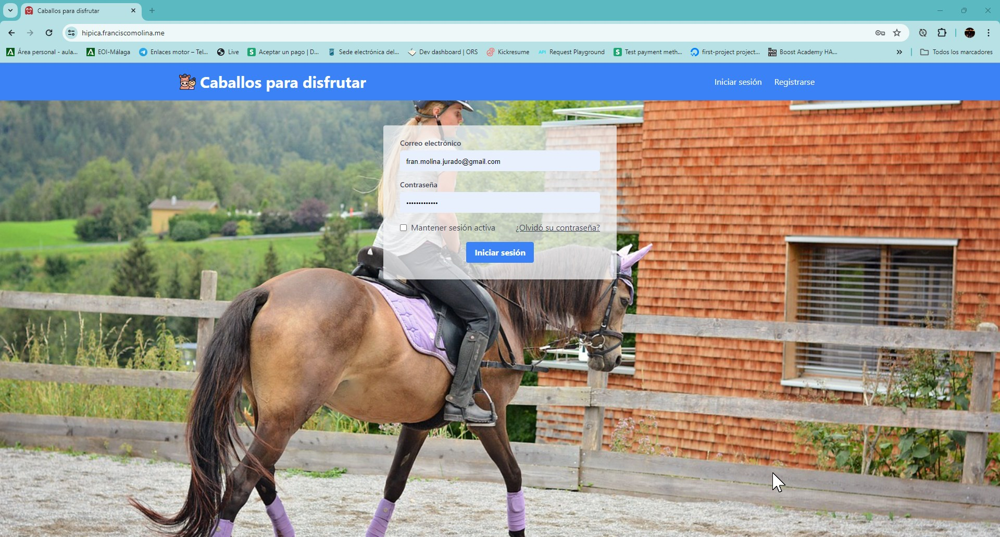
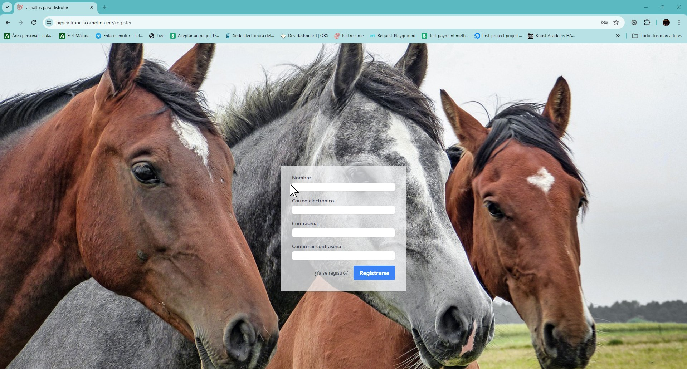
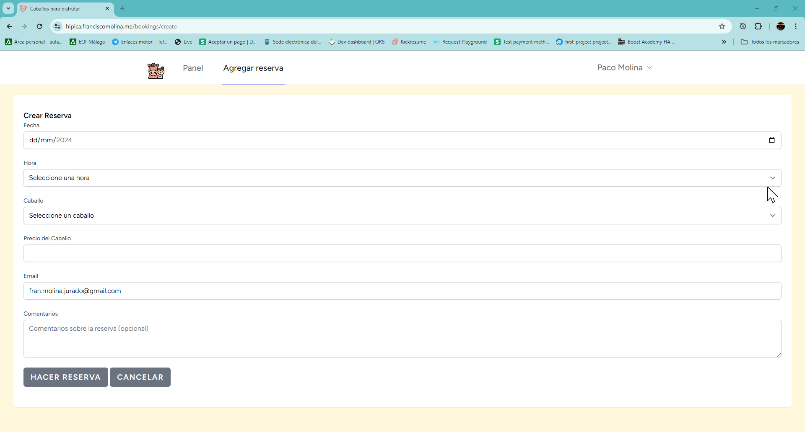
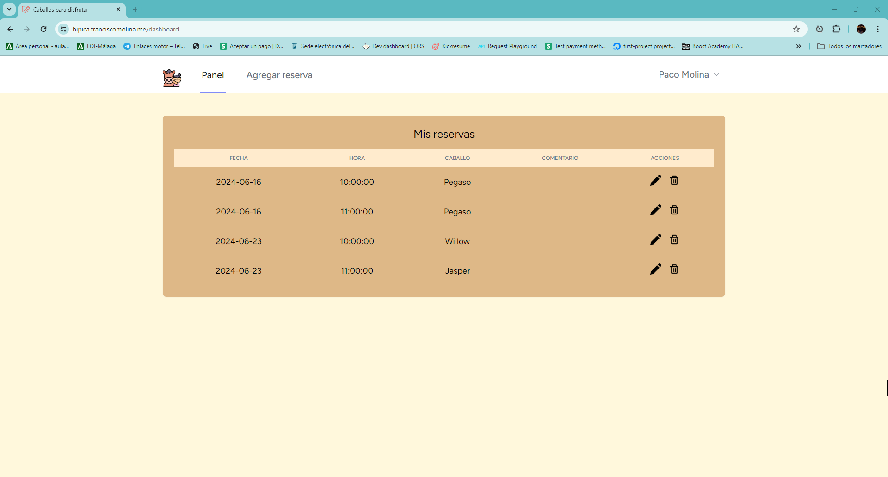
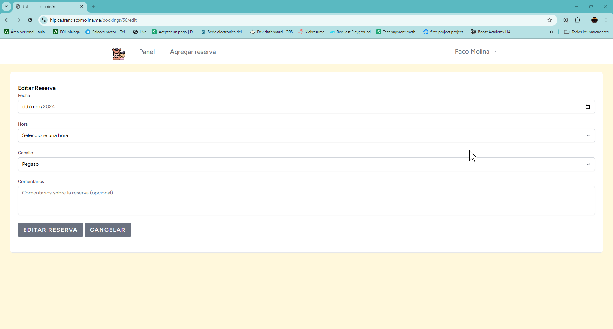

# Caballos para disfrutar

### IMPORTANTE
>El dump está en la carpeta:  _**resources/sql**_

Este proyecto es tanto aplicación web como una aplicación móvil de reservas de caballos. La aplicación permite a los usuarios reservar un caballo para un día y hora específicos. La aplicación está diseñada para ser fácil de usar, con una interfaz de usuario intuitiva y una arquitectura de software robusta.

## Descripción Detallada

La aplicación web de reservas de caballos es una plataforma que permite a los usuarios reservar un caballo para un día y hora específicos. Los usuarios pueden registrarse en la plataforma, iniciar sesión, hacer una reserva, ver sus reservas existentes y cancelar reservas si es necesario.

## Autenticación de usuarios

La autenticación de usuarios es una característica crucial de la aplicación. Los usuarios pueden registrarse proporcionando su nombre, correo electrónico y una contraseña. Los datos de los usuarios se almacenan de forma segura en la base de datos y se utilizan para personalizar la experiencia del usuario. Los usuarios pueden iniciar sesión en la aplicación utilizando sus credenciales de correo electrónico y contraseña.

En la portada lo primero que nos encontramos será el login del usuario:

En el cual previamente tendremos que crear un registro para poder logearnos.

## Creación y gestión de reservas

Una vez que un usuario ha iniciado sesión, puede hacer una reserva. Para hacer una reserva, el usuario selecciona un caballo, una fecha y una hora. La aplicación verifica la disponibilidad del caballo para la fecha y hora seleccionadas y, si el caballo está disponible, se crea la reserva. Los usuarios pueden ver todas sus reservas existentes y tienen la opción de cancelar cualquier reserva si es necesario.

### Crear reserva:

Una vez rellenado los campos, al hacer click en el botón de _**HACER RESERVA**_ nos mandará a la pasarela de pago para poder realizar la reserva con éxisto y una vez hecho todo eso, se nos mandará un correo con los detalles en PDF a nuestro correo

### Dashboard:

### Editar reservar.
Como podremos observar en la imagen del dashboard, aparecen dos iconos al lado de cada reservam en el apartado de _**ACCIONES**_, el icono del lápiz que aparece primero es el encargado de actualizar nuestra reserva, la cual nos enviará a la vista de editar, así poder editar la reserva.

Cuando hacemos la actualización se nos mostrará un mensaje de que la actualización ha sido llevada con exito y nos informa de que tendremos in correo electrónico en nuestro email de confirmación junto a un PDF con la reserva actualizada.

#### Mejora
>cuando se edite, lo suye es que si elige un caballo de diferente precio al precio de la reserva sin actualizar, que se le devuelva o pague la diferencia.

### Eliminar reserva
En este caso, cuando vamos hacer una eliminación de la reserva, se nos mostrará en el dashboard de verificación por si queremos o no queremos eliminar la reserva y si decimos que si, nos volverá a mostrar otro mensaje esta vez de satifacción y de que tenemos un correo con la notificación.

## Validación de datos de entrada

La aplicación valida todos los datos de entrada para garantizar que son correctos y completos. Esto incluye la verificación de las fechas y horas de las reservas, así como la verificación de los datos de los usuarios. Si los datos de entrada no son válidos, la aplicación muestra un mensaje de error al usuario.

## Tecnologías Utilizadas

Este proyecto utiliza varias tecnologías para proporcionar su funcionalidad:

- PHP: El lenguaje de programación principal utilizado para el desarrollo del servidor. PHP es un lenguaje de programación de servidor popular que es potente y flexible.
- Laravel: Un marco de trabajo de PHP que proporciona una estructura y herramientas para el desarrollo de la aplicación. Laravel facilita muchas tareas comunes de desarrollo web, como la autenticación de usuarios, la gestión de bases de datos y el enrutamiento.
- MySQL: El sistema de gestión de bases de datos utilizado para almacenar los datos de la aplicación. MySQL es un sistema de gestión de bases de datos relacional que es rápido, confiable y fácil de usar.
- Dompdf: Una biblioteca de PHP utilizada para generar PDFs. Dompdf convierte HTML a PDF, lo que permite a la aplicación generar documentos PDF a partir de plantillas HTML.
- Mail: Una biblioteca de PHP utilizada para enviar correos electrónicos. Mail facilita el envío de correos electrónicos desde la aplicación, lo que permite enviar notificaciones por correo electrónico a los usuarios.

## Cómo Instalar

Para instalar y ejecutar este proyecto en tu máquina local, sigue estos pasos:

1. Clona el repositorio en tu máquina local o en tu servidor utilizando git clone. Esto descargará una copia del código del proyecto en tu máquina.
2. Navega al directorio del proyecto en tu terminal. Puedes hacer esto utilizando el comando cd, seguido del nombre del directorio del proyecto.
3. Ejecuta composer install para instalar las dependencias del proyecto. Composer es un gestor de dependencias para PHP, y este comando instalará todas las bibliotecas y paquetes que el proyecto necesita para funcionar.
4. Crea un archivo .env en el directorio raíz del proyecto y configura tus credenciales de base de datos. Este archivo se utiliza para almacenar la configuración del entorno, como las credenciales de la base de datos y las claves de la API.
5. Ejecuta php artisan migrate para crear las tablas de la base de datos. Este comando utiliza las migraciones de Laravel para crear las tablas necesarias en la base de datos.
6. Inicia el servidor de desarrollo ejecutando php artisan serve. Esto iniciará el servidor de desarrollo de Laravel, y podrás acceder a la aplicación en tu navegador web en http://localhost:8000.  

## Cómo Usar

Para usar la aplicación, sigue estos pasos:

1. Abre la aplicación en tu navegador web. Si estás ejecutando la aplicación en tu máquina local, puedes hacer esto navegando a http://localhost:8000 en tu navegador.
2. Regístrate como usuario proporcionando tu nombre, correo electrónico y contraseña. Una vez que te hayas registrado, podrás iniciar sesión en la aplicación.
3. Inicia sesión con tus credenciales. Una vez que hayas iniciado sesión, podrás hacer reservas.
4. Navega a la página de reservas y selecciona un caballo, una fecha y una hora. Una vez que hayas hecho tu selección, haz clic en el botón "Reservar" para hacer tu reserva.
5. Confirma tu reserva. Recibirás una notificación por correo electrónico confirmando tu reserva.

## Licencia

Este proyecto está licenciado bajo la licencia MIT. Esto significa que puedes usar, copiar, modificar y distribuir el código del proyecto, siempre y cuando incluyas el aviso de copyright original.

## Contacto

Si tienes alguna pregunta, comentario o sugerencia, no dudes en ponerte en contacto con nosotros. Puedes enviarnos un correo electrónico a paco@franciscomolina.es